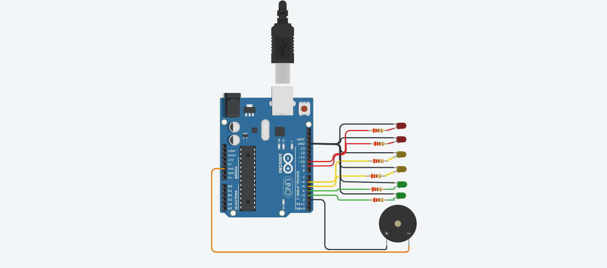
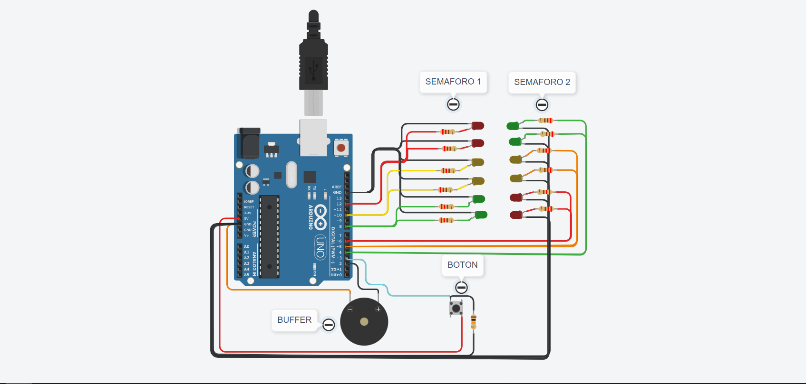

# Semaforo para invidentes

## Integrantes 
- Belen Soria
- Thiago Rodríguez
- Ivan Sacks
- Franco Sofia

#### Proyectos
Nota: Aquí se encuentra las entregas correspondientes al proyecto en orden ascendente.

## Proyecto: Dojo D, Semaforo para invidentes.
### Entrega n° 1

## Descripción
El semaforo cumple la funcion de, si bien ser un semaforo usual, también es un semaforo para invidentes, ya que cuenta con un pienzo. Este al hacer sonido durante la luz roja, le indica al usuario cuando no pasar.

## Función principal
Esta funcion se encarga de encender los leds y buzzer, y apagarlos.

LED_VERDE_A, LED_VERDE_B, TIEMPO_VERDE, LED_AMARILLO_A, LED_AMARILLO_B, TIEMPO_AMARILLO,
LED_ROJO_A, LED_ROJO_B, BUZZER son #define que utilizamos para agregar los leds, y el buzzer asociandolo a pines de la placa arduino.

En la funcion loop, llama las funciones PrenderApagarLeds, enviando los parametros, y PrenderApagardLedRojoBuzzer la cual cuando enciende, también suena el buzzer.
 
~~~ C (lenguaje en el que esta escrito)
void loop()
{
  PrenderApagarLeds(LED_VERDE_A,LED_VERDE_B, TIEMPO_VERDE);
  PrenderApagarLeds(LED_AMARILLO_A, LED_AMARILLO_B, TIEMPO_AMARILLO);
  PrenderApagardLedRojoBuzzer(LED_ROJO_A,LED_ROJO_B, BUZZER);
  PrenderApagarLeds(LED_AMARILLO_A, LED_AMARILLO_B, TIEMPO_AMARILLO);
}
~~~

## :chart_with_upwards_trend: Link al proyecto :traffic_light:
- [Belen Soria proyecto entrega n°1](https://www.tinkercad.com/things/i5YadsTv6GA-1d-dojo-d-soria/editel?sharecode=NJgFzQIbBMTWZXhFoCaBf0GYQ75TVjQc9fx_lACDTSc)

## :chart_with_upwards_trend: Link al proyecto de los integrantes :keycap_ten:
- [Thiago Rodríguez entrega n°1](https://www.tinkercad.com/things/fSnegusuI81-brave-elzing/editel?sharecode=V6gH1mG6p_U0Ck5-6Gz9RrXBJ6MydZY3HOWQgdQ9Vzk)

- [Ivan Sacks entrega n°1](https://www.tinkercad.com/things/0UM3ZlFqdpF-ivan-sacks-dojo-d-ejdojouno/editel?sharecode=t2-icXHy_uBGoIYf1aFnwEec6A11fBIYcaKNgTn3M8s)

- [Franco Sofia entrega n°1](https://www.tinkercad.com/things/cADprBpRUZb-copy-of-dojo-d-ejercicio-02-franco-sofia/editel?sharecode=s49qYkW5lOgLgG1-rdUSvXFMocdVisnxHcHN4Yv2QlY)

---

## Proyecto: Dojo D, Semaforo para invidentes.
### Entrega n° 2

## Descripción
El semaforo cumple la funcion de, si bien ser un semaforo usual, también es un semaforo para invidentes, ya que cuenta con un pienzo. Este al hacer sonido durante la luz roja, le indica al usuario cuando no pasar, además, al hacer un sonido cada segundo durante la luz amarilla, indica cuando tener precaución.

## Función principal
Esta funcion se encarga de encender los leds y buzzer, y apagarlos.

LED_AMARILLO_A, LED_AMARILLO_B, LED_ROJO_A, LED_ROJO_B, BUZZER son #define que utilizamos para agregar los leds, y el buzzer asociandolo a pines de la placa arduino.

En la funcion PrenderApagarLedBuzzer, primero se prende el led que se envió como parametro, luego en la condición notifica cual led está prendido. Además llama a la funcion PrenderApagardLedRojoBuzzer enviandole los parametros:
buzzer -> variable de tipo entero que representa el  pinMode del buzzer
buzzer_tiempo_segundos -> Variable de tipo entero que representa la cantidad de segundos que debe sonar el buzzer
1 o 2 -> La cantidad de sonidos por segundo

Y por último, apaga los leds.
 
~~~ C (lenguaje en el que esta escrito)
void PrenderApagarLedBuzzer(int led,int led_repuesto,int buzzer,int buzzer_tiempo_segundos)
{
  digitalWrite(led, HIGH);
  digitalWrite(led_repuesto, HIGH);
  if(led == LED_ROJO_A || led == LED_ROJO_B)
 {
    Serial.println("Prendido: Led rojo 5 segundos y buffer suena 2 veces por segundo.");
    PrenderApagarBuffer(buzzer,buzzer_tiempo_segundos,2);
 }
  else
 {
    if(led == LED_AMARILLO_A || led == LED_AMARILLO_B)
    {
      Serial.println("Prendido: Led amarillo por 3 segundos y buffer suena 1 vez por segundo.");
	  PrenderApagarBuffer(buzzer,buzzer_tiempo_segundos,1);
    }
 }
  digitalWrite(led, LOW);
  digitalWrite(led_repuesto, LOW);
}

~~~

## :chart_with_upwards_trend: Link al proyecto :frog:
- [Belen Soria entrega n°2](https://www.tinkercad.com/things/8tWmp2zrRWh-1d-dojo-d-ej-n2-soria-belen-2023-/editel)
## :chart_with_upwards_trend: Link al proyecto de los integrantes :shipit:

- [Ivan Sacks entrega n°2](https://www.tinkercad.com/things/kvZvP1zrmdb-ivan-sacks-dojo-d-ej2dojouno/editel?sharecode=FvJYjORmQpISy3dMQHERxsrFIkP-lHxH9M1NDHK18Qk)

- [Franco Sofia entrega n°2](https://www.tinkercad.com/things/6s5M8m5FxDc-copy-of-dojo-d-ejercicio-02-franco-sofia/editel?sharecode=FXjhoH82igXUJB7aCQC95aXAd4CDrPa2xdhEm2jtWgo)

- [Thiago Rodríguez entrega n°2](https://www.tinkercad.com/things/h5oIiVFxzgR-thiago-rodriguez-divd/editel?sharecode=jJqcy1OoAR5w1sQz9vH64kyxpN5jdOwAbp42giW3hAI)
---

## Proyecto: Dojo D, Semaforo para invidentes doble.
### Entrega n° 3

## Descripción
Codificamos un semaforo doble para invidentes, este hace dos sonidos cuando la luz roja esta prendinda y uno suave cuando la luz amarilla esta prendida.
Cuenta con un boton que al ser apretado, le da a la persona que lo requiera más tiempo para cruzar la calle. 

## Función principal
Esta funcion se encarga de verificar si el boton fue presionado, para guardar una varible que determine si el tiempo del led verde se duplicará.

boton_presionado y flag_presionado son variables globales que utilizamos para saber si se presionó el boton.

En la funcion RecibirTiempoLedVerde, primero leemos el estado del boton verde, y si este fue presionado se asigna 1 en el entero flag_presionado y se notifica por pantalla.

Y por último, apaga los leds.
 
~~~ C (lenguaje en el que esta escrito)

void RecibirTiempoLedVerde()
{
  boton_presionado = digitalRead(BOTON_VERDE);
  if (boton_presionado == 1)
  {
   flag_presionado = 1;
   Serial.println("La proxima luz verde se duplicara.");
  } 
}

~~~

## :chart_with_upwards_trend: Link al proyecto :frog:
- [Belen Soria entrega n°3](https://www.tinkercad.com/things/ivJPv2cZ5Ja-dojo-d-ej-n3-soria-belen-2023-/editel?sharecode=wJjJ3Cj_9mQjNvK-kEuC4N0wS01l-lZowrSQBpqGSMA)
## :chart_with_upwards_trend: Link al proyecto de los integrantes :shipit:

- [Ivan Sacks entrega n°3](https://www.tinkercad.com/things/0Lj1zFJznHd-ivan-sacks-dojo-d-ej3dojouno/editel?sharecode=fY1kJMpDqGoj8c3uDOqDfa6-XRFZToHtnDw2Az7gTX8)

- [Franco Sofia entrega n°3](https://www.tinkercad.com/things/8wTiuYKUPQa-dojo-d-ejercicio-03-franco-sofia/editel?sharecode=1S6-n7Oast0jZLrtovg34BKY_gjic5SmJO-DsaHVObM)

- [Thiago Rodríguez entrega n°3](https://www.tinkercad.com/things/cCXng1Xz3y0-copy-of-thiago-rodriguez-divd/editel?sharecode=95E4cJBhtGjh1JUqD6GpHRigzSrKL6J_SnyG1ZMma4I)

### Fuentes
- [Consejos para documentar](https://www.sohamkamani.com/how-to-write-good-documentation/#architecture-documentation).

- [Lenguaje Markdown](https://markdown.es/sintaxis-markdown/#linkauto).

- [Markdown Cheatsheet](https://github.com/adam-p/markdown-here/wiki/Markdown-Cheatsheet).

- [Tutorial](https://www.youtube.com/watch?v=oxaH9CFpeEE).

- [Emojis](https://gist.github.com/rxaviers/7360908).

---

